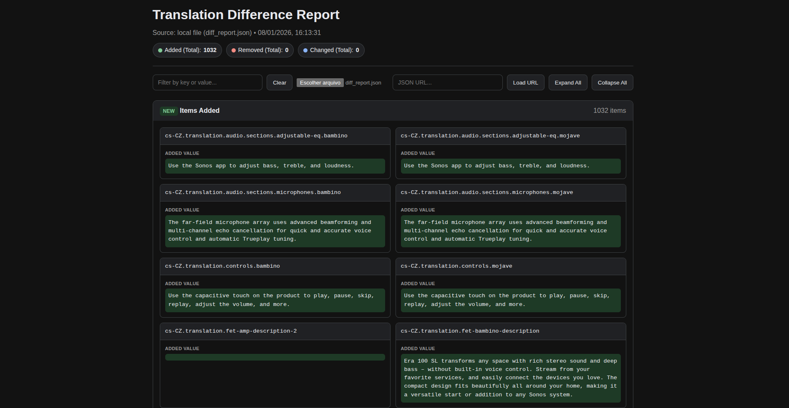

Claro, aqui está todo o conteúdo consolidado e reformatado em um único arquivo `README.md`.

---

# Translation Manager CLI


A command-line tool to manage i18n translation files by converting them between a structured JSON format and an XLSX spreadsheet.

This tool simplifies the translation workflow by allowing non-technical team members (like translators or project managers) to work with familiar spreadsheet software, while developers can easily integrate the results back into a JSON-based application structure.

## Table of Contents

- [Features](#features)
- [Prerequisites](#prerequisites)
- [Installation](#installation)
- [Usage](#usage)
  - [Exporting JSON to a Spreadsheet](#1-exporting-json-to-a-spreadsheet)
  - [Importing a Spreadsheet to JSON](#2-importing-a-spreadsheet-to-json)
  - [Reviewing the Difference Report](#3-reviewing-the-difference-report)
- [License](#license)

## Features

-   **Export (JSON to XLSX)**: Converts a nested translation JSON file into a clean, easy-to-use XLSX spreadsheet. All translation keys are listed in the first column, with each subsequent column representing a language.
-   **Import (XLSX to JSON)**: Converts a filled-out XLSX spreadsheet back into a structured JSON file.
-   **Difference Report**: During the import process, the tool compares the incoming spreadsheet data against a "base" JSON file and generates an interactive HTML report highlighting all changes. This makes it easy to review what was **added**, **removed**, or **modified**.
-   **Automatic Sorting**: Both keys and language codes are automatically sorted during the processes to ensure consistent output and clean diffs.

## Prerequisites

-   [Node.js](https://nodejs.org/) (v16.x or later recommended)
-   npm (comes bundled with Node.js)

## Installation

1.  **Clone the repository:**
    ```bash
    git clone <your-repository-url>
    cd <your-project-directory>
    ```

2.  **Install dependencies:**
    ```bash
    npm install
    ```

## Usage

The tool provides two main commands: `export` and `import`. To pass arguments to the scripts, use `npm run <command> -- <arguments...>`.

---

### 1. Exporting JSON to a Spreadsheet

Use the `export` command to convert your main JSON translation file into an XLSX spreadsheet. This is ideal for preparing the content for translators.

**Command:**

```bash
npm run export -- <path/to/input.json> [path/to/output.xlsx]
```

**Arguments:**

-   `path/to/input.json`: (Required) The source JSON translation file.
-   `path/to/output.xlsx`: (Optional) The destination path for the generated spreadsheet. Defaults to `output/output.xlsx`.

**Example:**

```bash
npm run export -- ./input/translations.json ./output/translations_for_review.xlsx
```

---

### 2. Importing a Spreadsheet to JSON

Use the `import` command to convert your XLSX spreadsheet back into a JSON file. During this process, a difference report will be generated by comparing the new data against a base JSON file.

**Command:**

```bash
npm run import -- <spreadsheet_path> <sheet_name> <base_json_path> [output_json_path] [diff_report_path]
```

**Arguments:**

-   `spreadsheet_path`: (Required) The source XLSX spreadsheet file.
-   `sheet_name`: (Required) The name of the sheet to import. **Remember to use quotes if the name contains spaces.**
-   `base_json_path`: (Required) Path to the original JSON file that the new data will be compared against.
-   `output_json_path`: (Optional) The destination for the new JSON file generated from the spreadsheet. Defaults to `output/translations.json`.
-   `diff_report_path`: (Optional) The destination for the report data JSON file. Defaults to `output/diff_report.json`.

**Example:**

```bash
npm run import -- ./input/translated_sheet.xlsx "Soundstage - 0801" ./input/original_translations.json
```

---

### 3. Reviewing the Difference Report

The `import` command generates a JSON data file (e.g., `diff_report.json`) containing all changes. The included `report.html` provides a user-friendly, interactive interface for reviewing this data.



**How to Use the Report:**

1.  Run the `import` command to generate the report data (e.g., `output/diff_report.json`).
2.  Open `report.html` in your web browser.
3.  Load the data in one of two ways:
    -   **Automatic:** Rename your report data file to `data.json` and place it in the same directory as `report.html`. The page will load it automatically on startup.
    -   **Manual:** Use the on-page controls to upload the report file from your computer or fetch it from a URL.

**Key Functionalities:**

-   **Clear Overview**: Changes are categorized into **Added**, **Removed**, and **Changed** sections, each with a total count for a quick summary.
-   **Dynamic Filtering**: A search bar allows you to instantly filter all items by key or value, making it easy to find specific translations.
-   **Side-by-Side Comparison**: For modified items, the report displays the old and new values next to each other, clearly highlighting the changes.
-   **Standalone and Shareable**: `report.html` is a single, self-contained file that runs in any modern browser without needing a server, making it easy to archive and share with your team.

## License

This project is licensed under the ISC License.